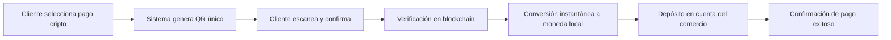

# Perfil Corporativo y Estrategia de Negocio - CryptoPoint

## 📋 Resumen Ejecutivo

**CryptoPoint** es una plataforma de pagos innovadora diseñada para transformar la manera en que las empresas, especialmente en los sectores de turismo y retail, aceptan criptomonedas. En un mundo donde los activos digitales ganan popularidad día a día, CryptoPoint elimina todas las barreras técnicas, financieras y operativas que tradicionalmente han impedido a los negocios convencionales beneficiarse de este mercado emergente.

> *"Acepte pagos en criptomonedas tan fácilmente como tarjetas de crédito - sin comisiones, sin volatilidad y sin barreras técnicas. Sus clientes pagan en cripto, usted recibe moneda local al instante."*

## 🏢 Perfil de la Empresa

### Misión
Democratizar la aceptación de criptomonedas para cualquier negocio, eliminando los obstáculos técnicos y financieros que han limitado su adopción en el comercio minorista y turístico.

### Visión
Convertirse en el estándar global para la integración de pagos cripto en empresas tradicionales, creando un ecosistema financiero más inclusivo y tecnológicamente avanzado.

### Valores Corporativos
- **Simplicidad**: Soluciones complejas presentadas de manera sencilla
- **Transparencia**: Sin comisiones ocultas ni letra pequeña
- **Innovación**: Combinando tecnología blockchain con necesidades comerciales reales
- **Accesibilidad**: Democratizando el acceso a tecnologías financieras avanzadas

## 💼 Modelo de Negocio

CryptoPoint ha desarrollado un modelo de negocio disruptivo que se destaca por:

### 1. Propuesta de Cero Comisiones
A diferencia de los procesadores de pago tradicionales que cobran entre 1.5% y 3.5% por transacción, CryptoPoint no cobra **absolutamente ninguna comisión** ni al comercio ni al cliente.

### 2. Protección Total Contra la Volatilidad
El sistema convierte instantáneamente los pagos recibidos en criptomonedas a la moneda local del comercio, eliminando por completo el riesgo asociado a las fluctuaciones del mercado cripto.

### 3. Monetización Alternativa
En lugar de depender de comisiones por transacción, CryptoPoint genera ingresos a través de:
- Spread controlado en la conversión de divisas
- Servicios premium para grandes empresas
- Alianzas estratégicas con exchanges y proveedores de liquidez

## 🎯 Segmentación de Mercado

### Mercados Primarios
1. **Sector Turístico**
   - Hoteles y alojamientos
   - Restaurantes en zonas turísticas
   - Operadores de tours y experiencias
   - Comercios en zonas de alto tráfico de turistas internacionales

2. **Retail Especializado**
   - Tiendas de lujo y productos premium
   - Comercios orientados a consumidores tech-savvy
   - Negocios con enfoque internacional

### Mercados Secundarios
- E-commerce y tiendas online
- Servicios profesionales
- Pequeñas y medianas empresas buscando innovación

## 🚀 Propuesta de Valor Diferencial

### Para Comercios
- **Cero Riesgo Financiero**: Sin volatilidad, sin comisiones, sin sorpresas
- **Simplicidad Técnica**: Integración plug-and-play sin necesidad de conocimientos técnicos
- **Expansión de Mercado**: Acceso a nuevos segmentos de clientes con poder adquisitivo
- **Imagen Innovadora**: Posicionamiento como negocio tecnológicamente avanzado

### Para Clientes
- **Libertad de Pago**: Utilización de sus activos digitales en comercios tradicionales
- **Experiencia Fluida**: Pagos rápidos y sin fricciones
- **Sin Costos Adicionales**: Ninguna comisión añadida a su compra
- **Seguridad Mejorada**: Transacciones verificables en blockchain

## 💹 Ventaja Competitiva (USP)

> *"La única solución de pago cripto para turismo y retail que garantiza cero comisiones, cero volatilidad y cero complicaciones técnicas - para que pueda aceptar cripto como un profesional, incluso si no sabe nada al respecto."*

| Característica | CryptoPoint | Competidores Tradicionales |
|----------------|-------------|----------------------------|
| Comisiones | 0% | 1-5% por transacción |
| Liquidación | Instantánea en moneda local | En cripto o con retrasos |
| Complejidad Técnica | Mínima, plug-and-play | Requiere conocimientos técnicos |
| Volatilidad | Eliminada completamente | Exposición parcial o total |
| Enfoque sectorial | Especializado en turismo y retail | Generalista |
| Requisitos | Sin hardware especial | A menudo requiere dispositivos |

## 📊 Análisis FODA

### Fortalezas
- Modelo sin comisiones altamente atractivo
- Eliminación total de la volatilidad
- Enfoque especializado en sectores específicos
- Simplicidad técnica extrema

### Oportunidades
- Crecimiento exponencial del mercado cripto
- Auge del turismo post-pandemia
- Demanda insatisfecha de soluciones simples
- Tendencia global hacia la digitalización de pagos

### Debilidades
- Marca en fase de desarrollo y reconocimiento
- Dependencia de proveedores de liquidez
- Requiere educación del mercado

### Amenazas
- Regulaciones cambiantes en el sector cripto
- Grandes players financieros entrando al mercado
- Posible resistencia de comercios tradicionales

## 🔄 Proceso Operativo

El flujo completo ocurre en segundos, ofreciendo una experiencia tan rápida como los pagos con tarjeta pero con las ventajas adicionales de la tecnología blockchain.

## 🛠️ Tecnología

CryptoPoint ha desarrollado una infraestructura tecnológica robusta que incluye:

### Arquitectura
- **Frontend**: Interfaz minimalista optimizada para dispositivos móviles y tabletas
- **Backend**: Sistemas de alta disponibilidad con redundancia geográfica
- **Integración Blockchain**: Conexiones optimizadas con múltiples redes

### Criptomonedas Soportadas
- Bitcoin (BTC)
- Ethereum (ETH)
- USDT (Tether)
- USDC (USD Coin)
- DAI
- BNB
- SOL (Solana)
- Y otras principales criptomonedas

### Seguridad
- Auditorías de seguridad continuas
- Cifrado de datos end-to-end
- Cumplimiento con estándares PCI-DSS

## 📈 Estrategia de Crecimiento

### Fase 1: Consolidación Regional
- Enfoque en mercados turísticos prioritarios
- Desarrollo de casos de éxito documentados
- Establecimiento de alianzas estratégicas locales

### Fase 2: Expansión Internacional
- Apertura de nuevos mercados geográficos
- Adaptación a múltiples monedas locales
- Desarrollo de equipos comerciales internacionales

### Fase 3: Diversificación de Servicios
- Implementación de programas de fidelidad basados en blockchain
- Desarrollo de soluciones financieras complementarias
- Posibles integraciones con metaverso y NFTs

## 🤝 Oportunidades de Colaboración

CryptoPoint busca activamente alianzas estratégicas con:

- **Asociaciones de turismo y comercio**
- **Proveedores de software de gestión (PMS, POS)**
- **Exchanges y plataformas cripto**
- **Empresas de marketing y publicidad especializada**
- **Instituciones educativas**

## 📞 Contacto

Para más información sobre CryptoPoint y cómo puede transformar su negocio:

- 🌐 **Web**: [cryptopoint.tech](https://cryptopoint.tech)
- 📧 **Email**: [info@cryptopoint.tech](mailto:info@cryptopoint.tech)
- 📱 **Redes sociales**: [@CryptoPointTech](https://twitter.com/cryptopointtech)

---

*Este perfil corporativo ha sido elaborado basado en la información pública disponible sobre CryptoPoint. Para información oficial y actualizada, se recomienda contactar directamente con la empresa.*
